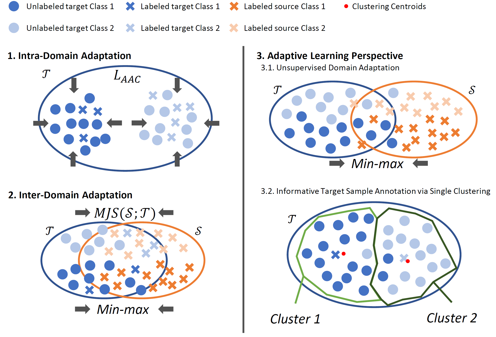

# Approach Semi-supervised Domain Adaptation from Two Perspective

EECS 542 4-student Group Project.

Feel free to find details in our report https://drive.google.com/file/d/1rwxnIiOJPfmQAJP7JgYmMBWaVxQofvcG/view.

Feel free to watch our video for this project https://drive.google.com/file/d/1GvuzagFYtzl7pGPiATP2Bm3_BxO67hOX/view.

Overview figure:

